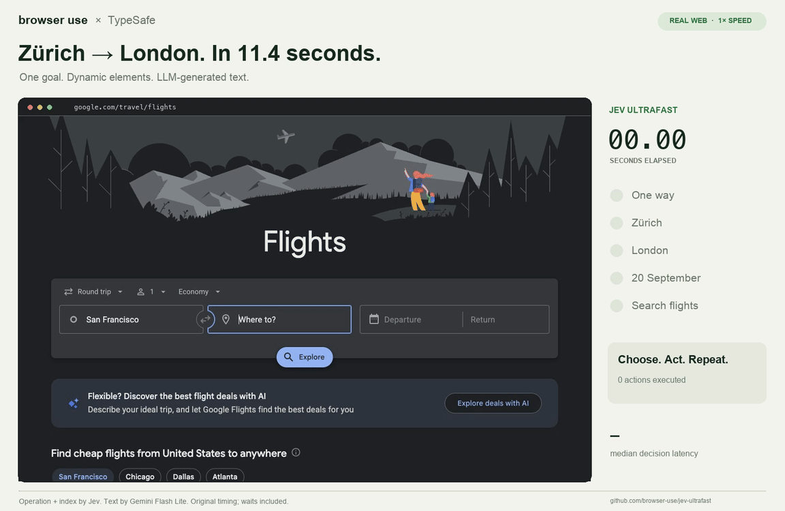

# Jev Ultrafast ⚡

**A browser agent with a dynamic, indexed action space.**

Give it one goal. [TypeSafe's Jev](https://docs.typesafe.ai/introduction) picks an operation and an element. A small LLM writes text only when the operation is `TYPE_TEXT`.

**Zürich → London on Google Flights in 11.4 seconds.** One natural-language goal, actual text generation, and loading waits included.

<a href="docs/demo.mp4"></a>

[Watch the MP4](docs/demo.mp4) · [Measurements](docs/performance.md) · [Read the loop](jev_ultrafast/agent.py)

## The action space

Every observation produces a new element table:

```text
[1] button    Change ticket type · Round trip
[2] combobox  Where from?        · San Francisco
[3] combobox  Where to?          · empty
[4] textbox   Departure          · empty
...
```

The operations are `CLICK`, `TYPE_TEXT`, `SELECT`, `SCROLL_UP`, `SCROLL_DOWN`, `WAIT`, `DONE`, and `BLOCKED`. Only supported operations and targets are offered.

```text
                      one TypeSafe request
                     ┌───────────────────────────┐
page → element table → operation                 │
                     │ click_target              │
                     │ type_text_target          │
                     │ select_target, if present │
                     └─────────────┬─────────────┘
                         use the matching target
                                   │
                    CLICK [7] ─────┤──→ browser
                TYPE_TEXT [3] ─────┘
                          ↓
                   small LLM → text → browser
```

Target questions are speculative. If the operation is `CLICK`, only `click_target` can execute. Two decisions, **one network round trip**. Each target head contains only compatible elements. Native dropdown choices carry an observed element/option index.

There are no site-specific action scripts or prepared field strings in the policy. The Flights example supplies a goal and independently verifies the outcome. The screenshot renderer adds labels afterward; it does not drive the browser.

## Try it

```bash
git clone https://github.com/browser-use/jev-ultrafast.git
cd jev-ultrafast
uv sync
cp .env.example .env
# Add TYPESAFE_API_KEY and TEXT_MODEL_API_KEY.
uv run jev
```

Open **http://127.0.0.1:8766** and click **Start demo → Run automatically**. The inspector shows numbered elements, operation probabilities, target probabilities, and executed actions. **Choose next** pauses before execution.

Chrome connects through [Browser Harness](https://github.com/browser-use/browser-harness), installed by `uv sync`. Run `uv run browser-harness --doctor` if it needs connecting. Allow remote debugging in Chrome when prompted.

`TEXT_MODEL_API_KEY` is an OpenRouter key in the example configuration. The current demo uses `google/gemini-2.5-flash-lite` with reasoning disabled. GLM and DeepSeek can also use the OpenAI-compatible text helper; configure the appropriate model, endpoint, and reasoning setting.

## Use the library

```python
from jev_ultrafast import Agent

with Agent(
    "https://www.google.com/travel/flights?hl=en",
    "Find one-way flights from Zurich to London on September 20, 2026, "
    "for one adult in economy. Stop when matching flight options are visible.",
) as agent:
    for state in agent.run():
        print(state["elapsed_ms"], state["status"])
```

Run with `uv run --env-file .env python your_script.py`. The same policy can run a different task:

```bash
uv run --env-file .env python examples/run.py \
  --url https://en.wikipedia.org/wiki/Main_Page \
  --goal 'Find and open the Wikipedia article about Gödel’s incompleteness theorems.'
```

`uv run --env-file .env python examples/flights.py --keep-open` performs the flight search, checks the actual route/date/results, and saves its trace. It does not select or book a flight.

## Why it moves

- **One request per decision cycle.** Operation and target heads share the same observed state.
- **No screenshots in the default agent loop.** Jev consumes structured state. The inspector opts into screenshots; the video uses a separate continuous screencast.
- **Read candidate elements.** Cache DOM references and batch fresh geometry reads instead of copying the entire page's scripts and markup each step.
- **Keep hidden tabs rendering.** Focus emulation prevents background animation throttling without switching Chrome's visible tab.
- **Send visible text.** Offscreen article bodies and footers do not fill the model context.
- **Reuse an interrupted text request.** A generated value survives a stale-page retry only if the entire text-helper input is unchanged.

Every executed target is resolved from an observed node. The executor rechecks page freshness and click occlusion. Model output never becomes selectors, coordinates, shell commands, or executable JavaScript. Text-helper output must parse as a small JSON object before typing.

## Small enough to read

| File | Job |
| --- | --- |
| [agent.py](jev_ultrafast/agent.py) | The complete loop and text-helper handoff |
| [browser.py](jev_ultrafast/browser.py) | Accessibility tree, visible text, fresh geometry, execution |
| [model.py](jev_ultrafast/model.py) | Dynamic operation/target heads and text generation |
| [questions.py](jev_ultrafast/questions.py) | Model instructions |
| [demo.py](jev_ultrafast/demo.py) | Local inspector |

## Evidence and limits

The current video is an **11,387 ms** Google Flights run. Timing starts after initial page observation and includes model calls, real generated text, browser work, stale decisions, and loading waits. An independent check verifies the one-way setting, Zürich, London, September 20, 2026, and visible flight options. The video plays at 1× with short opening/closing holds.

The same operation/target policy has also opened the requested Wikipedia article. These are small live demonstrations, not a general reliability benchmark. Earlier development runs, failures, model choices, and measurement boundaries are documented in [performance.md](docs/performance.md).

The recording predates a shared-rule fix for search/filter targets. The final policy passed the same flight search again in 12.9 seconds and a local filter regression in 4.4 seconds; the original recording and regression measurements are kept separately.

The older 12.9-second video used five prepared steps and copied quoted strings. It is historical evidence, not the current architecture. A `DONE` choice still requires independent outcome verification. Frames, canvas, uploads, pop-up tabs, nested scrolling, and arbitrary keyboard widgets remain outside this MVP. Owned tabs share the existing Chrome profile.

## Development

```bash
uv run ruff check .
uv run pytest
node --check jev_ultrafast/static/app.js
uv build
```

Tests are offline. Live examples and recording scripts make paid API calls. `scripts/record_flights.py` captures original browser timestamps; `scripts/render_demo.py` renders the selected verified run at 1× and crops out the Google account strip. Credentials and raw traces stay ignored.

---

[Browser Use](https://github.com/browser-use/browser-use) · [Browser Harness](https://github.com/browser-use/browser-harness) · [TypeSafe speculative fan-out](https://docs.typesafe.ai/patterns/fan-out)
